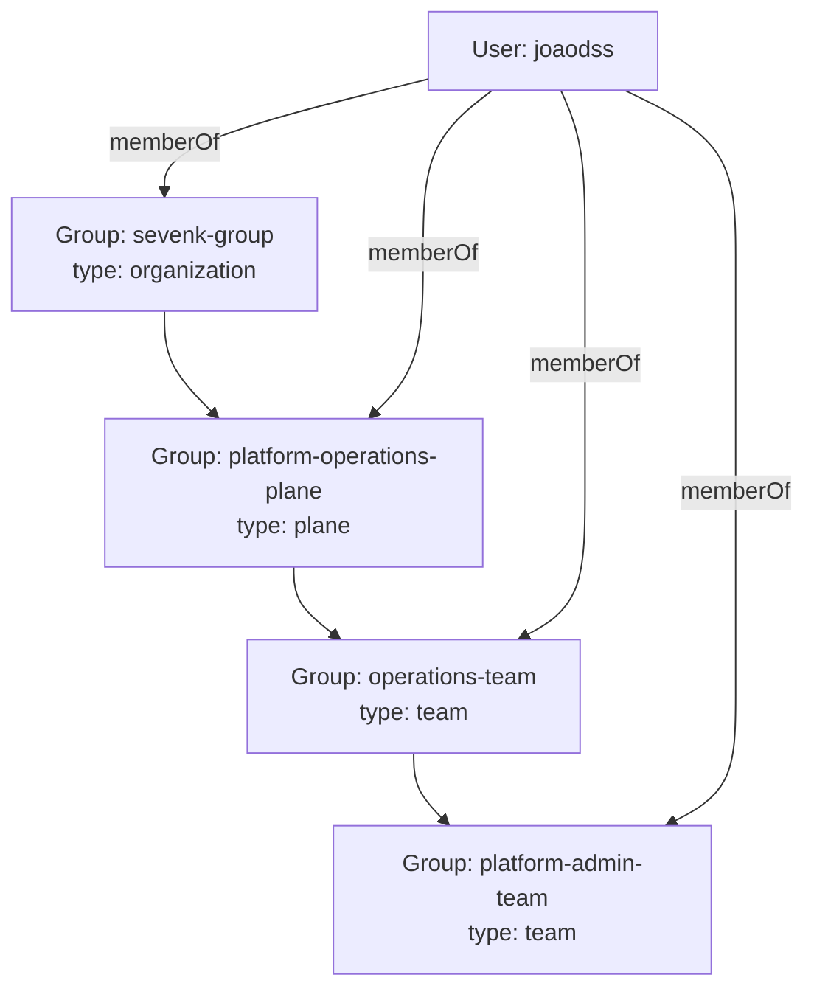

# Catalog structure

This repository is intended to be registered in Backstage as a **single Location**.
All catalog entities live under `catalog/` and are separated by function:

- `catalog/sourcecode/`: Components (services, libraries)
- `catalog/apis/`: APIs provided/consumed by components
- `catalog/cicd/`: CI/CD resources (pipelines, workflows, deploy definitions)
- `catalog/tests/`: test-suite resources
- `catalog/monitoring/`: monitoring resources (dashboards, alerts)
- `catalog/systems/`: systems (collections of components)
- `catalog/domains/`: domains (business/engineering domains)
- `catalog/groups/`: groups (team ownership)
- `catalog/environments/`: environment resources (dev/stage/prod)

Conventions:

- `metadata.name`: kebab-case, globally unique within its kind
- `spec.owner`: `group:platform` (or another group defined in `catalog/groups/`)
- Components should reference their system via `spec.system`.

## Organization inheritance graph

Backstage relations are direct; user membership is not automatically inferred from child teams to parent groups.
To show a user on team, plane, and organization levels, include each ancestor in `User.spec.memberOf` (or define equivalent direct `Group.spec.members` entries).
